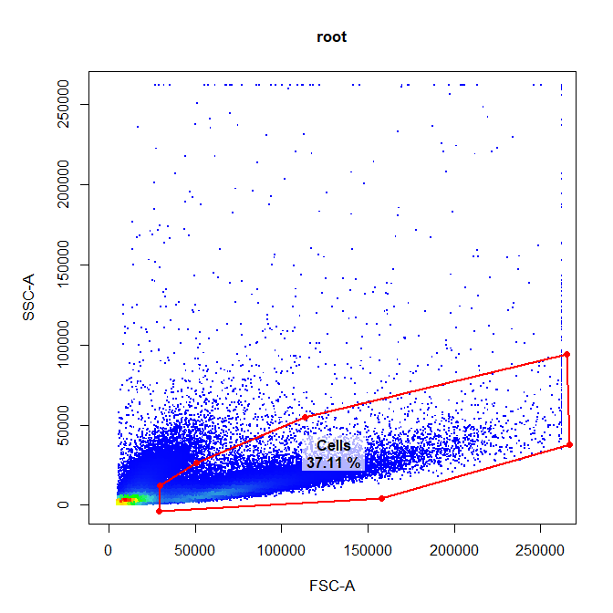
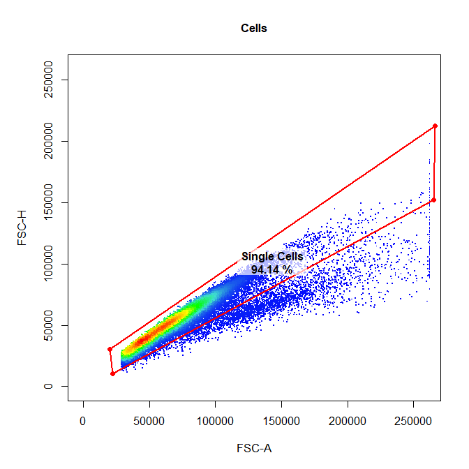
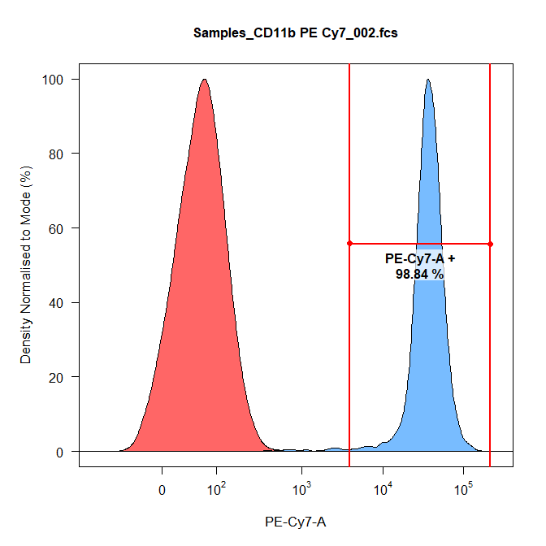
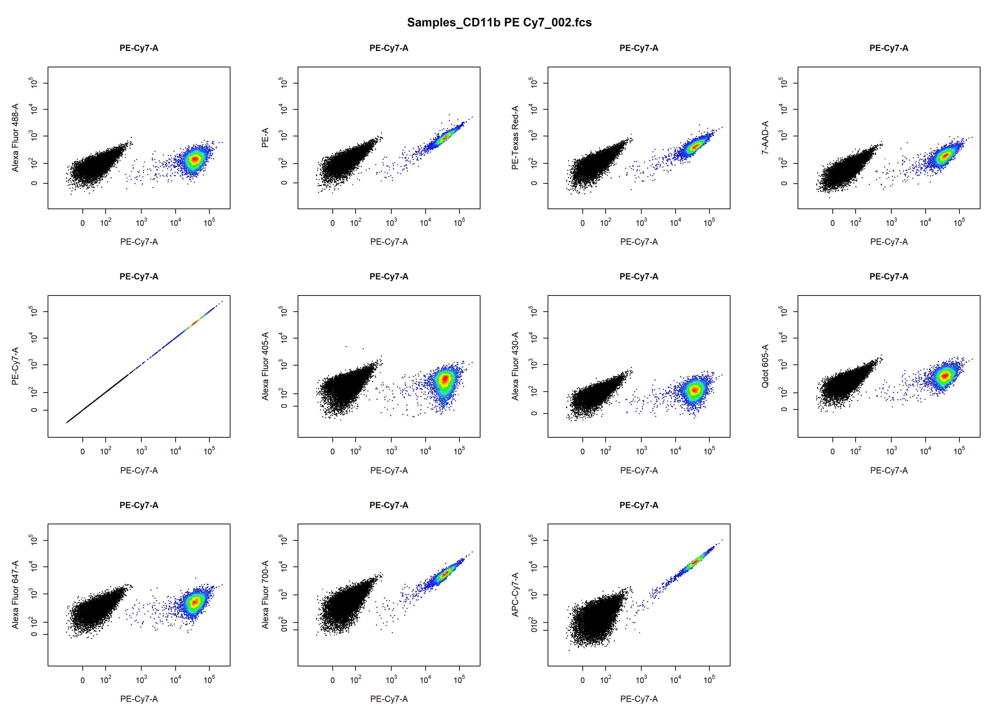
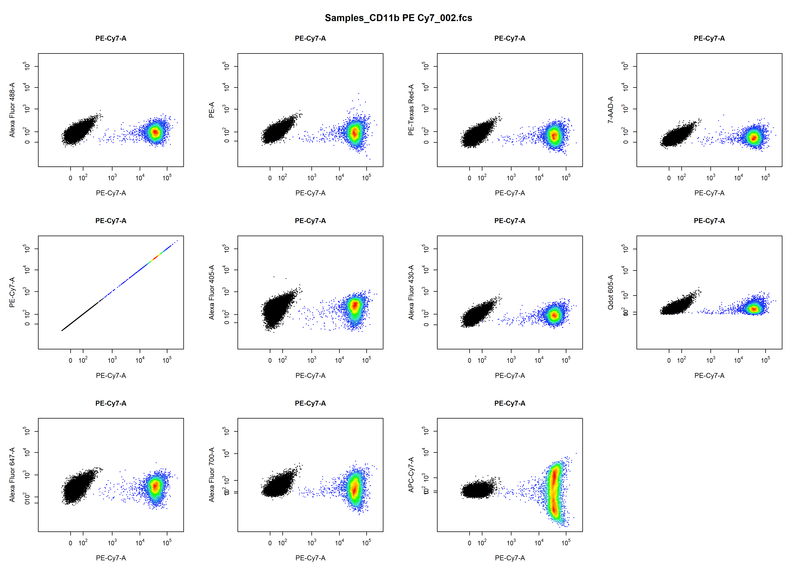

```{r setup, include=FALSE}
knitr::opts_chunk$set(echo = TRUE)
```

## 1. **Introduction**

**cytoRSuite** provides some useful functions to aid in compensation of fluorescent spillover, including **computeSpillover** for automated compensation, **editSpillover** to interactively modify spillover matrices and **plotCytoComp** to visualise compensation. Here we aim to demonstrate the appropriate use of these functions to obtain accurate spillover values for compensation.

The **cytoRSuite** compensation workflow is as follows:

1. Load in compensation controls and an unstained control into a **GatingSet**.
2. Gate samples using **drawGate** to home in on a homogenous cell population (e.g. Single Cells).
3. Use **computeSpillover** to automatically calculate the spillover matrix values.
4. Fine tune spillover values interactively using **editSpillover**.
5. Visualise compensation using **plotCytoComp** to identify any issues.
6. If issues exist continue to fine tune the spillover values using **editSpillover**.
7. Finally apply the saved spillover matrix .csv file to samples prior to transformation of fluorescent channels and gating.

## 2. Demonstration of Compensation Features

### 2.1 Load in Compensation controls

Traditionally, all compensation controls including an universal unstained control are stored in a folder called "Compensation Controls" in the current working directory. Currently, there are no single stain controls included in **cytoRSuite** so you will need to use your own samples for this workflow.

To start let's load these files into R as an **ncdfFlowSet** called **fs**:
```{r, eval = FALSE}
library(cytoRSuite)

files <- list.files(path = "Compensation Controls", full.names = TRUE)
fs <- read.ncdfFlowSet(files = files)
```

### 2.2 Gate Compensation Cntrols

Next we will load the samples into a **GatingSet** for gating using **drawGate**:
```{r, eval = FALSE, message = FALSE}
gs <- GatingSet(fs)
```

Let's gate the samples to home in on the Single Cells population. Gating prior to using **computeSpillover** will yield much more accurate spillover values.

```{r, echo = FALSE, eval = FALSE, message = FALSE, warning = FALSE}
gt <- gatingTemplate("Compensation gatingtemplate.csv")
gating(gt,gs)
```

```{r, eval = FALSE}
# Cells
drawGate(gs,
         parent = "root",
         alias = "Cells",
         channels = c("FSC-A","SSC-A"),
         gtfile = "Compensation gatingTemplate.csv")
```

```{r echo=FALSE, out.width='75%', out.height='75%',fig.align="center"}

```

```{r, eval = FALSE}
# Cells
drawGate(gs,
         parent = "Cells",
         alias = "Single Cells",
         channels = c("FSC-A","FSC-H"),
         gtfile = "Compensation gatingTemplate.csv")
```

```{r echo=FALSE, out.width='75%', out.height='75%',fig.align="center"}

```

### 2.3 Automated Spillover Calculation Using **computeSpillover**

**computeSpilllover** will guide the user through channel selection for each of the compensation conrols and save these selections to "Compensation Channels.csv" for downstream use. This file can be passed tothe cmfile file argument of **plotCytoComp** to bypass the channel selection process. Next the user gates the positive signal for each single stain control using an **interval** gate. This populaton will be used internally to calculate the percentage spillover based on the unstained control. The calculated spillover matrix is returned and written to a csv file for downstream analyses. The anme of theis file is controlled by the **spfile** argument.

```{r, eval = FALSE}
spill <- computeSpillover(gs, parent = "Single Cells", spfile = "Spillover Matrix.csv")
```

#### 2.3.1 Channel Selection Process

Users are prompted to select a fluorescent channel for each of the compensation controls from a drop-down menu. The results are saved to a csv file called "Compensation Channels.csv" for later use. This channel selection process can be bypassed by suppling the name of a channel match file ("cmfile") to the **cmfile** argument.

```{r, echo=FALSE, out.width='100%', out.height='100%',fig.align="center"}
knitr::include_graphics('Compensation/ChannelSelect.png')
```

#### 2.3.2 Gating Positive Signal

A density distribution of each control in the appropriate channel will be plotted for users to gate the positive signal to use for spillover calculation. The unstained control is overlayed in red as a reference for gating.

```{r, echo=FALSE, out.width='75%', out.height='75%',fig.align="center"}

```

#### 2.3.3 Reading Exported Spillover Matrix File

The calculated spillover matrix can be read into R using read.csv for downstream use:
```{r, eval = FALSE}
spill <- read.csv("Spillover Matrix.csv", header = TRUE, row.names = 1)
colnames(spill) <- rownames(spill)
spill
```

```{r, eval = TRUE, echo = FALSE}
spill <- read.csv("Compensation/Spillover-Matrix.csv", header = TRUE, row.names = 1)
colnames(spill) <- rownames(spill)
spill
```

### 2.4 Modify Spillover Values Interactively Using **editSpillover**

**editSpillover** leverages a shiny interface to facilitate realtime visualisation of changes to fluorescent spillover values. 

```{r, eval = FALSE}
editSpillover(gs, parent = "Single Cells", spfile = "Spillover Matrix.csv")
```

**editSpillover** features:

- automatic plot updates with changes to spillover values
- matrix cell colour change indicates the degree of compensation required
- overlay **unstained** control as a reference
- red horizontal line indicating median fluorescent intensity of the unstained control
- purple **median tracker** line which monitors changes in the median fluorescent intensity of the stained population
- **save** updates by clicking save button

```{r, echo=FALSE, out.width='100%'}
knitr::include_graphics('Compensation/editSpillover.png')
```

Modifying the spillover values will automatically result in the plot being updated. The correct spillover value is such that the median of the stained population is equal to that of the unstained population (i.e. red line and purple line should meet in the center of the stained population). Below we have modified the bottom left spillover value the result of which is shown below:

```{r, echo=FALSE, out.width='100%'}
knitr::include_graphics('Compensation/editSpilloverComp.png')
```

### 2.5 Visualise Compensation Using **plotCytoComp**

**plotCytoComp** will automatically plot each compensation control in all fluorescent channels to identify any potential compensation issues. To identify issue simply scroll through the plots by clicking the arrows in the **Plots** window. For brevity only the plots for PE Cy7 compensation control are shown below:

```{r, eval = FALSE}
# Un-compensated
plotCytoComp(gs, 
             parent = "Single Cells", 
             cmfile = "Compensation Channels.csv")
```

```{r echo=FALSE, out.width='100%'}

```

```{r, eval = FALSE}
# Compensated
plotCytoComp(gs, 
             parent = "Single Cells", 
             cmfile = "Compensation Channels.csv",
             compensate = TRUE,
             spfile = "Spillover Matrix.csv")
```

```{r echo=FALSE, out.width='100%'}

```

## 3. More Information

For more information refer to the cytoRSuite vignettes and help documentation for each of the described functions.

Dillon Hammill, BMedSci (Hons)
<br /> Ph.D. Scholar
<br /> The Parish Group Cancer & Vascular Biology
<br /> ACRF Department of Cancer Biology and Therapeutics
<br /> The John Curtin School of Medical Research
<br /> ANU College of Medicine, Biology and the Environment
<br /> The Australian National University
<br /> Acton ACT 2601
<br /> Dillon.Hammill@anu.edu.au
